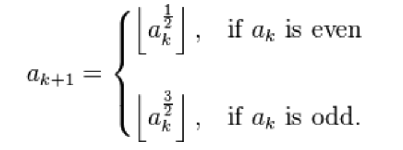

 <section id="themes">
	<h2>Themes</h2>
		<p>
			Set your presentation theme: <br>
			<!-- Hacks to swap themes after the page has loaded. Not flexible and only intended for the reveal.js demo deck. -->
			<a href="#" onclick="document.getElementById('theme').setAttribute('href','css/theme/black.css'); return false;">Black (default)</a> -
			<a href="#" onclick="document.getElementById('theme').setAttribute('href','css/theme/white.css'); return false;">White</a> -
			<a href="#" onclick="document.getElementById('theme').setAttribute('href','css/theme/league.css'); return false;">League</a> -
			<a href="#" onclick="document.getElementById('theme').setAttribute('href','css/theme/sky.css'); return false;">Sky</a> -
			<a href="#" onclick="document.getElementById('theme').setAttribute('href','css/theme/beige.css'); return false;">Beige</a> -
			<a href="#" onclick="document.getElementById('theme').setAttribute('href','css/theme/simple.css'); return false;">Simple</a> <br>
			<a href="#" onclick="document.getElementById('theme').setAttribute('href','css/theme/serif.css'); return false;">Serif</a> -
			<a href="#" onclick="document.getElementById('theme').setAttribute('href','css/theme/night.css'); return false;">Night</a> -
			<a href="#" onclick="document.getElementById('theme').setAttribute('href','css/theme/moon.css'); return false;">Moon</a> -
			<a href="#" onclick="document.getElementById('theme').setAttribute('href','css/theme/solarized.css'); return false;">Solarized</a>
		</p>
</section>

H:

# Integer sequences

<small>by [Julian Salomon](https://github.com/JulianSalomon)</small>

H:

# Index

 1. Fibonacci <!-- .element: class="fragment" data-fragment-index="1"-->
 1. Golomb <!-- .element: class="fragment" data-fragment-index="2"-->
 1. Juggler <!-- .element: class="fragment" data-fragment-index="3"-->
 
H:

## Fibonacci

Are the numbers in the following integer sequence:

>1, 1, 2, 3, 5, 8, 13, 21, 34, 55, 89, 144...<!-- .element: class="fragment" data-fragment-index="1"-->


V:

## Fibonacci: Definition

For n=0, F(0)=0,

For n=1, F(1)=1, <!-- .element: class="fragment" data-fragment-index="1"-->

For n>1, F(n)=F(n-1)+F(n-2). <!-- .element: class="fragment" data-fragment-index="2"-->

V:

## Fibonacci: Processing code

```java
int fibo(int n){
  if(n==0)
    return 0;                                      
  if(n==1)
    return 1;                                      
  if(n>1)
    return fibo(n-1)+fibo(n-2);                    
  return -1;
}
```

V:

## Fibonacci: Graphic representation

<div id='fibo_id'></div>

H:

## Golomb

Are the numbers in the following integer sequence:

>1, 2, 2, 3, 3, 4, 4, 4, 5, 5, 6, 6...<!-- .element: class="fragment" data-fragment-index="1"-->


V:

## Golomb: Definition

For n=1, a(1)=1,

For n=2, a(2)=2, <!-- .element: class="fragment" data-fragment-index="1"-->

For n>1, a(n+1)=1+a(n+1-a(a(n))). <!-- .element: class="fragment" data-fragment-index="2"-->

V:

## Golomb: Processing code

```java
int golomb(int n){
  if(n==1)
    return 1;
  if(n>1)
    return 1+golomb(n-golomb(golomb(n-1)));
  return 0;
}
```

V:

## Golomb: Graphic representation

<div id='Golomb_id'></div>

H:

## Juggler

Juggler returns the following Integer Array sequence

>[1], [2,1], [3,5,11,36,6,2,1], [4,2,1]...<!-- .element: class="fragment" data-fragment-index="1"-->


V:

## Juggler: Definition

This sequence starts with a positive integer in a(0)


For next sequence values is:<!-- .element: class="fragment" data-fragment-index="1"-->

<figure>
    <a href="https://en.wikipedia.org/wiki/Juggler_sequence">
        
    </a>
</figure><!-- .element: class="fragment" data-fragment-index="1"-->

When reach 1 the juggler sequence've ended.<!-- .element: class="fragment" data-fragment-index="2"-->

V:

## Juggler: Definition

An example starting with a(0)=4 is:

a(1)=floor(4^1/2)=2 <!-- .element: class="fragment" data-fragment-index="1"-->

a(2)=floor(2^1/2)=1 <!-- .element: class="fragment" data-fragment-index="2"-->

Juggler(4)=[4,2,1]<!-- .element: class="fragment" data-fragment-index="2"-->

V:

## Juggler: Processing code Array

```java
int[] juggler(int n) {
  int tam=tamArr(n);
  int jugg[]= new int[tam];
  jugg[0]=n;
  for(int i=0; i+1<tam; i++) {
    jugg[i+1]=proc(n);
    n=jugg[i+1];
  }
  return jugg;
}
```

V:

## Juggler: Processing code Array size

```java
int tamArr(int n) {
  int a;
  for(a=0; n>1; a++)
    n=proc(n);
  return a+1;
}
```

V:

## Juggler: Processing code Value of Array position

```java
int proc(int n) {
  if(isEven(n))
    return floor(sqrt(n));
  return floor(sqrt(n)*sqrt(n)*sqrt(n));
}
```

V:

## Juggler: Graphic representation

<div id='Juggler_id'></div>

H:

# References

* [Fibonacci sequence](https://en.wikipedia.org/wiki/Fibonacci_number)
* [Golomb sequence](https://en.m.wikipedia.org/wiki/Golomb_sequence)
* [Juggler sequence](https://en.wikipedia.org/wiki/Juggler_sequence)
* [OEIS: Number of steps needed for juggler sequence](https://oeis.org/A007320)

H:

<div align="centered">
  <div id='Sketch_id'></div>
</div>
